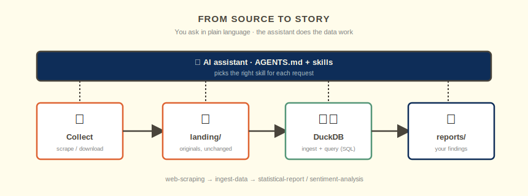
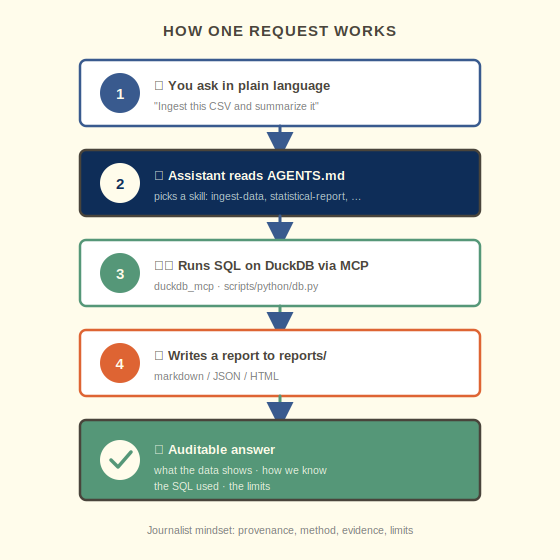
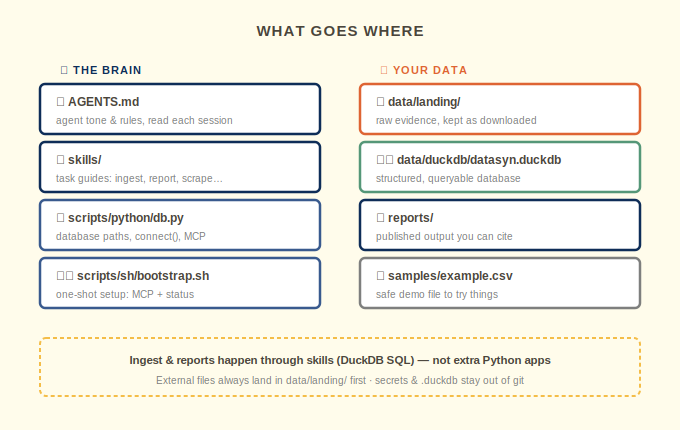
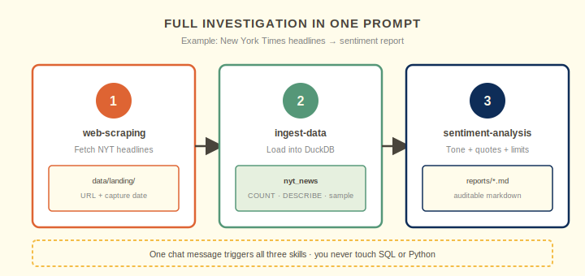

<div align="center">

# 📰 datasyn-local

**Investigate with data on your own machine** — using plain language.

<p>
  <span style="background:#0e2d58;color:#fffceb;padding:4px 10px;border-radius:4px;font-weight:600">🤖 AI Assistant</span>
  <span style="background:#559778;color:#fffceb;padding:4px 10px;border-radius:4px;font-weight:600">🗄️ DuckDB</span>
  <span style="background:#395a8e;color:#fffceb;padding:4px 10px;border-radius:4px;font-weight:600">🔌 MCP</span>
</p>

*Also available in [Español neutro](README.md)*

</div>

---

## At a glance

You collect sources → the assistant saves the originals → DuckDB holds structured tables → you query the data through AI. **No need to write SQL or Python — and you don't need Python installed yourself.**

<p align="center"></p>


---

## ✨ Who is this for?

**Journalists, researchers, and teams working with sources, documents, or data you can reach on your own machine.**

**The AI assistant** sets up the environment with the **startup prompt** below. Day-to-day work uses **[skills](skills/)**; tone and rules live in **[AGENTS.md](AGENTS.md)**.

---

## 🧭 How it works

### Principles

| Principle | What it means for you |
|-----------|------------------------|
| **Keep originals** | Downloads and extractions stay in `data/landing/` — nothing is overwritten |
| **Use plain language** | You ask in clear language; **skills** turn the request into DuckDB SQL (via MCP) |


### Data flow

The assistant picks the right **skill** at each stage (orange = raw files, green = database, navy = reports).

<p align="center"></p>

| Step | You | Skill | Output |
|:----:|-----|-------|--------|
| 1 | Save downloads, scrapes, exports | `web-scraping` | `data/landing/` |
| 2 | Ask to "ingest" a file | `ingest-data` | table in DuckDB |
| 3 | Ask questions in plain language | SQL + MCP | answers in chat |
| 4 | Request analysis or a report | `statistical-report` / `sentiment-analysis` / `graph-analysis` | `reports/` |

### One request, start to finish

A single message ("ingest this file and summarize it") always follows the same path:

<p align="center"></p>

### Repository map

Left: agent configuration and behavior. Right: your evidence and publishable output.

<p align="center"></p>

---

## 📌 Requirements

- **Python 3.11+** (the assistant installs it if missing)
- **[uv](https://docs.astral.sh/uv/)** — Python environment (configured by the startup prompt)

### Install an IDE

You need an editor with a built-in AI assistant:

- **[OpenCode](https://opencode.ai):** `curl -fsSL https://opencode.ai/install | bash`
- **[VS Code](https://code.visualstudio.com/):** [Download](https://code.visualstudio.com/download) · macOS: `brew install --cask visual-studio-code`

---

## 🚀 Get started — copy this prompt

### Initial setup

Clone the repository, paste the prompt below, and follow the assistant's summary.

1. **Clone** this repository and open it in your IDE.
2. **Paste** the block into the assistant chat.
3. **Follow** the summary — you shouldn't need to run commands yourself.

<details>
<summary><strong>📋 Click to view the startup prompt</strong></summary>

```text
Bootstrap datasyn-local in this workspace. The user is a journalist/researcher — explain steps in plain language.

0. Configure the uv environment first:
   - If uv is missing: install it (curl -LsSf https://astral.sh/uv/install.sh | sh or brew install uv)
   - From the repo root: uv sync --all-extras
   - Verify: uv --version and uv run python -c "import duckdb; print('duckdb', duckdb.__version__)"

1. Read AGENTS.md and skills/README.md (use setup-uv skill if more detail is needed).

2. Link skills for your IDE:
   - **Cursor:** ln -sfn "$(pwd)/skills" .cursor/skills
   - **VS Code:** no symlink needed — reads skills/ directly

3. Configure the DuckDB MCP server (so the AI assistant can query the database):
   - Run: uv run python scripts/python/db.py mcp-config
     (this generates .cursor/mcp.json with the configuration)
   - **VS Code:** copy .cursor/mcp.json to .vscode/mcp.json:
     cp .cursor/mcp.json .vscode/mcp.json
     (VS Code 1.96+ uses .vscode/mcp.json automatically)
   - **VS Code alternative:** you can also paste the contents of .cursor/mcp.json
     into .vscode/settings.json under the key "github.copilot.chat.agent.mcpServers"
   - **Cursor:** .cursor/mcp.json is already ready

4. Run bootstrap from the repo root:
   chmod +x scripts/sh/bootstrap.sh
   ./scripts/sh/bootstrap.sh
   (configures MCP, verifies MCP, and shows database status.)

Rules: ingest and reports are skills (SQL), not extra Python apps. External files always go to data/landing/ first. Summarize each step for a non-technical reader.
```

</details>

### ✅ When the assistant finishes

| | You should have |
|---|----------------|
| 🐍 | `uv` + `.venv` with dependencies |
| 🔌 | `.cursor/mcp.json` (Cursor) or `.vscode/mcp.json` (VS Code) — both local, not committed to git |
| 🛠️ | `skills/` linked in the IDE |
| 🗄️ | MCP connected to `data/duckdb/datasyn.duckdb` |

---

## 🗞️ Full example — from headlines to sentiment

### One prompt, full investigation

**Scrape → ingest → sentiment report** in a single message:

<p align="center"></p>

Paste this into the assistant:

```text
Run a full pipeline for me, explaining each step in plain language:

1. Scrape recent New York Times news headlines
   (web-scraping skill) and save the raw results to data/landing/
   — keep the source URL and capture date for provenance.
2. Ingest that file into DuckDB as a table called nyt_news
   (ingest-data skill). Then show COUNT(*), DESCRIBE, and 5 sample rows.
3. Run a sentiment analysis on the headline and summary text
   (sentiment-analysis skill) and write a markdown report to reports/
   with: overall tone, a positive/neutral/negative breakdown, a few
   representative quotes, and the limits of the method.

Remember: external files go to data/landing/ first, ingest and
reports are skills (DuckDB SQL), and tell me what the data shows,
how we know, and what the caveats are.
```

> ⚖️ **Sources:** respect each site's terms and `robots.txt`; prefer official feeds or APIs when available. The assistant keeps source URL and capture date so findings are auditable.
