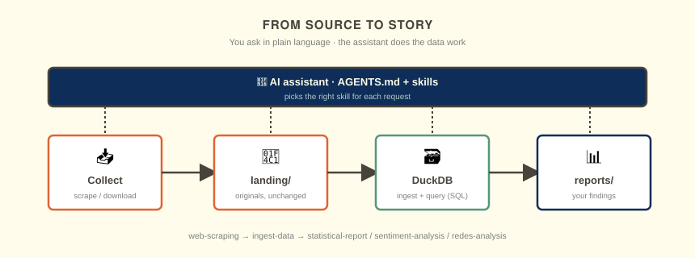
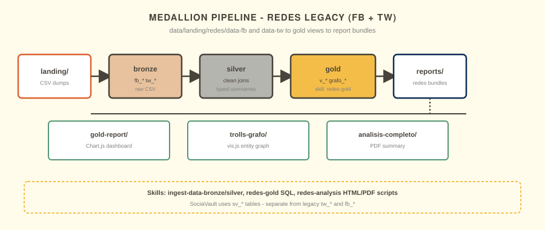
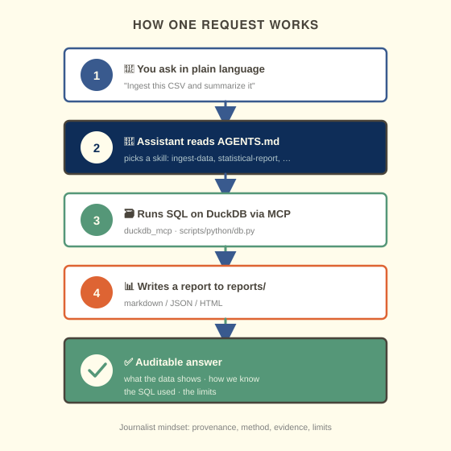
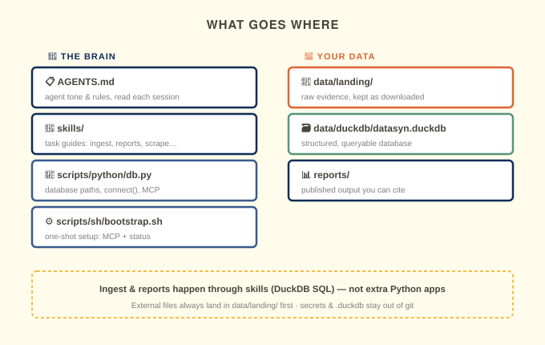
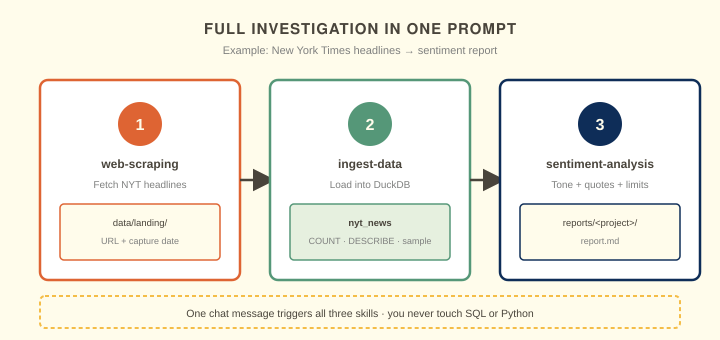

<div align="center">

# 📰 datasyn-local

**Investigate with data on your own machine** — using plain language.

<p>
  <span style="background:#0e2d58;color:#fffceb;padding:4px 10px;border-radius:4px;font-weight:600">🤖 AI Assistant</span>
  <span style="background:#559778;color:#fffceb;padding:4px 10px;border-radius:4px;font-weight:600">🗄️ DuckDB</span>
  <span style="background:#395a8e;color:#fffceb;padding:4px 10px;border-radius:4px;font-weight:600">🔌 MCP</span>
</p>

*Also available in [Español neutro](README.md)*

</div>

---

## At a glance

You collect sources → the assistant saves the originals → DuckDB holds structured tables → you query the data through AI. **No need to write SQL or Python — and you don't need Python installed yourself.**

<p align="center"></p>

## Table of contents

1. [Install](#install)
2. [Where to put a CSV in landing](#where-to-put-a-csv-in-landing)
3. [How to ingest a CSV into DuckDB](#how-to-ingest-a-csv-into-duckdb)
4. [Import another DuckDB and query tables](#import-another-duckdb-and-query-tables)
5. [How it works](#how-it-works)
6. [Full example](#full-example)
7. [Create a new skill](#create-a-new-skill)
8. [Gitflow](#gitflow)
9. [Guides](#guides)
10. [Tools](#tools)

---

## ✨ Who is this for?

**Journalists, researchers, and teams working with sources, documents, or data you can reach on your own machine.**

**The AI assistant** sets up the environment with the **startup prompt** below. Day-to-day work uses **[skills](skills/)**; tone and rules live in **[AGENTS.md](AGENTS.md)**; shared vocabulary in **[CONTEXT.md](CONTEXT.md)**.

---

## How it works

### Principles

| Principle | What it means for you |
|-----------|------------------------|
| **Keep originals** | Downloads and extractions stay in `data/landing/` — nothing is overwritten |
| **Use plain language** | You ask in clear language; **skills** turn the request into DuckDB SQL (via MCP) |


### The pieces

| Piece | Role |
|-------|------|
| 🤖 **AI assistant + [skills](skills/)** | Turn plain-language requests into concrete SQL steps |
| 📋 **[AGENTS.md](AGENTS.md)** | Tone, rules, and workflow for the assistant |
| 📖 **[CONTEXT.md](CONTEXT.md)** | Shared vocabulary — medallion zones, landing, reports, MCP vs ingest |
| 🗄️ **DuckDB** (`data/duckdb/`) | Local analytics engine where tables live |
| 🔌 **MCP** | Bridge that lets the assistant run SQL on the database |
| 📂 **`data/landing/` → `reports/<project>/`** | Raw inputs at the door, publishable outputs at the end |

### Skills by scope

Skills are grouped into **buckets** under [`skills/`](skills/). Full index: [`skills/README.md`](skills/README.md). Layout guide: [`docs/skills-layout.md`](docs/skills-layout.md).

| Scope | Folder | Router skill |
|-------|--------|--------------|
| **Collect** | [`skills/collect/`](skills/collect/README.md) | `scrape-sociavault`, `web-scraping` |
| **Ingest** | [`skills/ingest/`](skills/ingest/README.md) | `ingest-data` → bronze / silver / gold |
| **Analyze** | [`skills/analyze/`](skills/analyze/README.md) | reports, graphs |
| **Schema** | [`skills/schema/`](skills/schema/README.md) | `create-table` |
| **Infra** | [`skills/infra/`](skills/infra/README.md) | `setup-uv`, `configure-duckdb-mcp` |
| **Engineering** | [`skills/engineering/`](skills/engineering/README.md) | `gitflow`, `data-privacy` |

User flow router: [`datasyn-router`](skills/datasyn-router/SKILL.md).

### Medallion pipeline

Data moves through quality stages; the assistant picks the right skill at each step.

| Stage | What happens | Skill |
|-------|--------------|-------|
| **Landing** | Save downloads, scrapes, exports untouched | [`web-scraping`](skills/collect/web-scraping/SKILL.md) |
| 🟤 **Bronze** | Raw files loaded into DuckDB as-is | [`ingest-data-bronze`](skills/ingest/bronze/ingest-data-bronze/SKILL.md) |
| ⚪ **Silver** | Clean, dedupe, normalize, join | [`ingest-data-silver`](skills/ingest/silver/ingest-data-silver/SKILL.md) |
| 🟡 **Gold** | Aggregate and summarize for analysis | [`ingest-data-gold`](skills/ingest/gold/ingest-data-gold/SKILL.md) |
| **Reports** | Analysis and final documents | [`statistical-report`](skills/analyze/reports/statistical-report/SKILL.md) · [`sentiment-analysis`](skills/analyze/reports/sentiment-analysis/SKILL.md) · [`graph-analysis`](skills/analyze/graph/graph-analysis/SKILL.md) |

> Entry point for ingest: [`ingest-data`](skills/ingest/ingest-data/SKILL.md) routes to the correct zone (bronze, silver, or gold).

Legacy FB/TW pipeline (CSV under `data/landing/redes/`):

<p align="center"></p>

### Data flow (summary)

| Step | You | Skill | Output |
|:----:|-----|-------|--------|
| 1 | Save downloads, scrapes, exports | [`web-scraping`](skills/collect/web-scraping/SKILL.md) | `data/landing/` |
| 2 | Ask to "ingest" a file | [`ingest-data`](skills/ingest/ingest-data/SKILL.md) | table in DuckDB |
| 3 | Ask questions in plain language | SQL + MCP | answers in chat |
| 4 | Request analysis or a report | [`statistical-report`](skills/analyze/reports/statistical-report/SKILL.md) / [`sentiment-analysis`](skills/analyze/reports/sentiment-analysis/SKILL.md) / [`graph-analysis`](skills/analyze/graph/graph-analysis/SKILL.md) | `reports/<project>/` |

### One request, start to finish

A single message ("ingest this file and summarize it") always follows the same path:

<p align="center"></p>

### Repository map

Left: agent configuration and behavior. Right: your evidence and publishable output.

<p align="center"></p>

---

## Install

To get started you only need **(1)** an AI assistant and **(2)** to clone this repository. The [startup prompt](#get-started) configures the rest (`uv`, skills, MCP).

### 1. Install an AI assistant

Use any of these (the most common ones):

- [Cursor](https://cursor.com/)
- [Claude Code](https://claude.ai/code) (Anthropic)
- [GitHub Copilot](https://github.com/features/copilot) in [VS Code](https://code.visualstudio.com/)
- [Google Antigravity](https://antigravity.google/)
- [OpenCode](https://opencode.ai/)

### 2. Clone the repository

```bash
git clone <repository-URL>
cd datasyn-local
```

Open the folder in your assistant and continue with [Get started](#get-started).

### Configure tools

The startup prompt installs and configures what you need. For reference, the project uses:

- **Python 3.11+**
- **[uv](https://docs.astral.sh/uv/)** — Python environment

Other tools (for example **R**) are only required when a specific analysis asks for them.

---

## Get started

You already have the repo open in the assistant. Paste the prompt below: it configures `uv` (Python), links the [skills](skills/), and connects the DuckDB MCP server.

1. **Paste** the block into the assistant chat.
2. **Follow** the summary — you shouldn't need to run commands yourself.

<details>
<summary><strong>📋 Click to view the startup prompt</strong></summary>

```text
Bootstrap datasyn-local in this workspace. The user is a journalist/researcher — explain steps in plain language.

0. Configure the uv environment first:
   - If uv is missing: install it (curl -LsSf https://astral.sh/uv/install.sh | sh or brew install uv)
   - From the repo root: uv sync --all-extras
   - Verify: uv --version and uv run python -c "import duckdb; print('duckdb', duckdb.__version__)"

1. Read AGENTS.md, CONTEXT.md, and skills/README.md (use setup-uv skill if more detail is needed).

2. Link skills for your IDE:
   - **Cursor:** ln -sfn "$(pwd)/skills" .cursor/skills
   - **VS Code:** no symlink needed — reads skills/ directly

3. Configure the DuckDB MCP server (so the AI assistant can query the database):
   - Run: uv run python scripts/python/db.py mcp-config
     (this generates .cursor/mcp.json with the configuration)
   - **VS Code:** copy .cursor/mcp.json to .vscode/mcp.json:
     cp .cursor/mcp.json .vscode/mcp.json
     (VS Code 1.96+ uses .vscode/mcp.json automatically)
   - **VS Code alternative:** you can also paste the contents of .cursor/mcp.json
     into .vscode/settings.json under the key "github.copilot.chat.agent.mcpServers"
   - **Cursor:** .cursor/mcp.json is already ready

4. Run bootstrap from the repo root:
   chmod +x scripts/sh/bootstrap.sh
   ./scripts/sh/bootstrap.sh
   (configures MCP, verifies MCP, and shows database status.)

Rules: ingest and reports are skills (SQL), not extra Python apps. External files always go to data/landing/ first. Summarize each step for a non-technical reader.
```

</details>

### ✅ When the assistant finishes

| | You should have |
|---|----------------|
| 🐍 | `uv` + `.venv` with dependencies |
| 🔌 | `.cursor/mcp.json` (Cursor) or `.vscode/mcp.json` (VS Code) — both local, not committed to git |
| 🛠️ | `skills/` linked in the IDE |
| 🗄️ | MCP connected to `data/duckdb/datasyn.duckdb` |

---

## Where to put a CSV in landing

Every raw file (CSV, JSON, scrape, export) goes first into **`data/landing/`**. That folder is the **originals** zone: do not edit files there; cleaning and analysis happen later inside DuckDB.

Shared vocabulary: [`CONTEXT.md`](CONTEXT.md). Principle: **keep originals**.

### Example with the sample CSV

There is a fictional tweet-style dataset at [`examples/data_example.csv`](examples/data_example.csv). Copy it to landing:

```bash
cp examples/data_example.csv data/landing/
```

`data/landing/` is gitignored (not committed). The file under `examples/` is versioned so anyone can repeat the tutorial.

More detail: [`examples/README.md`](examples/README.md).

---

## How to ingest a CSV into DuckDB

**You do not write SQL.** Ask in plain language; the assistant uses the **skills** ([`ingest-data`](skills/ingest/ingest-data/SKILL.md) → [`ingest-data-bronze`](skills/ingest/bronze/ingest-data-bronze/SKILL.md)), generates the SQL, and loads the table into DuckDB for you.

Short flow:

1. The CSV is already in `data/landing/` (previous step).
2. Paste the prompt below into the chat.
3. The assistant creates `bronze.tweets_example`, validates rows, and can run a mini-analysis.

<details>
<summary><strong>📋 Prompt — ingest the sample CSV and analyze it</strong></summary>

```text
Ingest data/landing/data_example.csv into DuckDB as bronze.tweets_example
(skill ingest-data). Then show COUNT(*), DESCRIBE, and 5 sample rows,
plus a mini-analysis: top authors by likes and tweets per day.
```

</details>

> **Optional note:** reads go through MCP; writes (CREATE TABLE / ingest) use `db.py run-sql --ingest` and may briefly stop MCP. Rules in [`AGENTS.md`](AGENTS.md).

---

## Import another DuckDB and query tables

If someone gives you a file like **`warehouse-01.duckdb`** (for example with Twitter/X scrapes already loaded), you can use it as the main database.

### Steps

```bash
# 1. Place the file under data/duckdb/
cp /path/to/warehouse-01.duckdb data/duckdb/

# 2. Point datasyn at that database
export DATASYN_DB_PATH=data/duckdb/warehouse-01.duckdb

# 3. Regenerate MCP config and verify
uv run python scripts/python/db.py mcp-config
uv run python scripts/python/db.py info
```

Restart the MCP server in your IDE so it picks up the new path. Then ask in chat, for example:

```text
List the tables in the database and show the 10 tweets with most likes
from silver.tk_tw_tweet (or the equivalent table). What do the data show?
```

Tables named `silver.tk_tw_*` are the typical result of scraping an account with [`scrape-twikit-twitter`](skills/collect/twikit/scrape-twikit-twitter/SKILL.md).

### Other options

| Goal | How |
|------|-----|
| Combine two databases without replacing yours | read-only `ATTACH` — see [`docs/guia-datos.md`](docs/guia-datos.md) §2.3 |
| Scrape an X account yourself | same guide §1 + skill `scrape-twikit-twitter` |

---

## Full example

### One prompt, full investigation

**Scrape → ingest → sentiment report** in a single message:

<p align="center"></p>

Paste this into the assistant:

```text
Run a full pipeline for me, explaining each step in plain language:

1. Scrape recent New York Times news headlines
   (web-scraping skill) and save the raw results to data/landing/
   — keep the source URL and capture date for provenance.
2. Ingest that file into DuckDB as a table called nyt_news
   (ingest-data skill). Then show COUNT(*), DESCRIBE, and 5 sample rows.
3. Run a sentiment analysis on the headline and summary text
   (sentiment-analysis skill) and write a markdown report to reports/<project>/
   with: overall tone, a positive/neutral/negative breakdown, a few
   representative quotes, and the limits of the method.

Remember: external files go to data/landing/ first, ingest and
reports are skills (DuckDB SQL), and tell me what the data shows,
how we know, and what the caveats are.
```

> ⚖️ **Sources:** respect each site's terms and `robots.txt`; prefer official feeds or APIs when available. The assistant keeps source URL and capture date so findings are auditable.

---

## Gitflow

This repo uses **Gitflow**: `main` is production-ready; `develop` holds integrated work; short-lived **feature** branches merge into `develop`.

```
main     ●─────────●─────────────────●  (tags: v1.0.0)
          \       /
develop    ●──●──●──●──●──●──●  ← integration
                \    /
feature          ●──●           ← new work
```

| Branch | Prefix | Base | Merge into | Purpose |
|--------|--------|------|------------|---------|
| **main** | — | — | — | Releasable production |
| **develop** | — | `main` | — | Daily integration |
| **feature** | `feature/` | `develop` | `develop` | Skills, ingest, scripts |
| **release** | `release/` | `develop` | `main` + `develop` | Version stabilization |
| **hotfix** | `hotfix/` | `main` | `main` + `develop` | Urgent production fix |

### Typical feature workflow

```bash
git checkout develop && git pull origin develop
git checkout -b feature/my-change
# ... commits (skills/SQL/scripts only — never data/landing/, .env, reports)
git push -u origin HEAD
# PR → develop (preferred) or local --no-ff merge
git checkout develop && git merge --no-ff feature/my-change
git branch -d feature/my-change
git push origin --delete feature/my-change   # if pushed to remote
```

### Check branch state

```bash
./scripts/sh/gitflow.sh status    # current branch, type, divergence from main/develop
./scripts/sh/gitflow.sh branches  # local feature branches and merge status
```

Full agent workflow: [`skills/engineering/gitflow/SKILL.md`](skills/engineering/gitflow/SKILL.md) · cheat sheet: [`skills/engineering/gitflow/reference.md`](skills/engineering/gitflow/reference.md)

**Commit style:** `feat(scope):`, `fix(scope):`, `docs(scope):` — no PII or raw data in messages. Read [`data-privacy`](skills/engineering/data-privacy/SKILL.md) before committing.

---

## Create a new skill

A **skill** is a Markdown workflow guide — not executable code. The assistant reads `SKILL.md` and follows the steps (SQL templates, validation, output paths).

**Where skills live:** under a scope bucket in [`skills/`](skills/) — e.g. `skills/ingest/bronze/ingest-data-bronze/SKILL.md`.

Shared vocabulary: [`CONTEXT.md`](CONTEXT.md). Full index: [`skills/README.md`](skills/README.md). Layout guide: [`docs/skills-layout.md`](docs/skills-layout.md).

After creating a skill, add it to the bucket `README.md` and [`skills/README.md`](skills/README.md). Update [`datasyn-router`](skills/datasyn-router/SKILL.md) if user-facing flows change.

---

## Guides

| Guide | Contents |
|-------|----------|
| [`docs/guia-datos.md`](docs/guia-datos.md) | Ready-to-paste prompts: X/Twitter (twikit), scrape, optional LLM + clusters, reports; share or point to an external DuckDB *(Spanish)* |
| [`docs/guia-monitoreo-redes.md`](docs/guia-monitoreo-redes.md) | Unified social monitor: personas across platforms, reactions, haters, graphs *(Spanish)* |
| [`docs/monitoreo-redes-tecnico.md`](docs/monitoreo-redes-tecnico.md) | Technical maintenance guide for the monitoring system |

Diagrams: [`docs/diagrams/README.md`](docs/diagrams/README.md) — SVG sources in [`docs/diagrams/`](docs/diagrams/), palette in [`docs/colors/README.md`](docs/colors/README.md).

---

## Tools

| Tool | Purpose | Docs |
|------|---------|------|
| 🗄️ **DuckDB** | Local analytics database | [duckdb.org/docs](https://duckdb.org/docs/) |
| 🔌 **MCP** | Connects the AI assistant to DuckDB | [modelcontextprotocol.io](https://modelcontextprotocol.io/) |
| 🧩 **Skills** | Scoped task guides (see [`skills/`](skills/), [`docs/skills-layout.md`](docs/skills-layout.md)) | [Agent Skills](https://docs.anthropic.com/en/docs/agents-and-tools/agent-skills/overview) |
| 🐍 **uv** | Python environment manager | [docs.astral.sh/uv](https://docs.astral.sh/uv/) |
