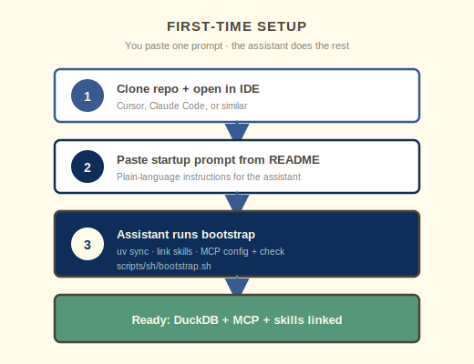

<div align="center">

# 📰 datasyn-local

**Investiga con datos en tu propia computadora** — sin ser experto en análisis de datos.

<p>
  <span style="background:#0e2d58;color:#fffceb;padding:4px 10px;border-radius:4px;font-weight:600">🤖 Asistente IA</span>
  <span style="background:#559778;color:#fffceb;padding:4px 10px;border-radius:4px;font-weight:600">🗄️ DuckDB</span>
  <span style="background:#395a8e;color:#fffceb;padding:4px 10px;border-radius:4px;font-weight:600">🔌 MCP</span>
</p>

*Versión en [English](README.md)*

</div>

---

## En resumen

Recolectas fuentes → el asistente guarda los originales → DuckDB tiene tablas estructuradas → los reportes tienen tus hallazgos. **No necesitas escribir SQL ni Python.**


| | |
|---|---|
| **Tú** | Periodista, investigador, equipo editorial |
| **Asistente** | Cursor, Claude Code, etc. + [skills](skills/) |
| **Reglas** | [AGENTS.md](AGENTS.md) — trazabilidad, método, evidencia, límites |

---

## ✨ ¿Para quién es?

**Periodistas, investigadores y equipos que trabajan con fuentes, documentos y datos públicos** — no hace falta saber SQL ni Python.

Tú traes las preguntas y la hipótesis. **El asistente de IA** configura el entorno con el **prompt de arranque** de abajo. El trabajo diario usa **[skills](skills/)**; el tono y las reglas están en **[AGENTS.md](AGENTS.md)**.

> **No necesitas ser analista de datos.** Guarda los archivos originales, pide en lenguaje claro y deja que el asistente ingiera, consulte y arme reportes.

---

## 🧭 Cómo funciona

### Principios

| Principio | Qué significa para ti |
|-----------|------------------------|
| **Conservar originales** | Descargas y extracciones quedan en `data/landing/` — sin sobrescribir |
| **Hablar, no programar** | Pides en lenguaje claro; los **skills** convierten el pedido en SQL de DuckDB (vía MCP) |
| **Mantener trazabilidad** | Cada respuesta indica *qué muestran los datos*, *cómo lo sabemos* y *cuáles son los límites* |

### Figura 1 — Flujo de datos

El asistente elige el **skill** correcto en cada etapa (naranja = archivos crudos, verde = base de datos, azul marino = reportes).


| Paso | Tú | Skill | Salida |
|:----:|----|-------|--------|
| 1 | Guardas descargas, scrapes, exportaciones | `web-scraping` | `data/landing/` |
| 2 | Pides “ingestar” un archivo | `ingest-data` | tabla en DuckDB |
| 3 | Haces preguntas en lenguaje claro | SQL + MCP | respuestas en el chat |
| 4 | Pides análisis o un reporte | `statistical-report` / `sentiment-analysis` | `reports/` |

### Figura 2 — Un pedido, de principio a fin

Un mensaje (“ingesta este archivo y resúmelo”) sigue siempre el mismo camino:


### Figura 3 — Mapa del repositorio

Izquierda: configuración y comportamiento del agente. Derecha: tu evidencia y salida publicable.


---

## 📌 Requisitos

- **Python 3.11+** (lo instala el asistente si falta)
- **[uv](https://docs.astral.sh/uv/)** — entorno Python (lo configura el prompt de arranque)
- **Un asistente de IA con skills** (por ejemplo Cursor)

---

## 🚀 Arranque — copia este prompt

### Figura 4 — Configuración inicial

Clona el repositorio, pega el prompt de abajo y sigue el resumen del asistente.



1. **Clona** este repositorio y ábrelo en el IDE.
2. **Pega** el bloque en el chat del asistente.
3. **Sigue** el resumen — no deberías tener que ejecutar comandos por tu cuenta.

<details>
<summary><strong>📋 Clic para ver el prompt de arranque</strong></summary>

```text
Bootstrap datasyn-local en este workspace. El usuario es periodista/investigador, no ingeniero de datos — explica los pasos en lenguaje claro.

0. Configura el entorno uv primero:
   - Si no hay uv: instálalo (curl -LsSf https://astral.sh/uv/install.sh | sh o brew install uv)
   - Desde la raíz del repo: uv sync --all-extras
   - Verifica: uv --version y uv run python -c "import duckdb; print('duckdb', duckdb.__version__)"

1. Lee AGENTS.md y skills/README.md (usa el skill setup-uv si hace falta más detalle).

2. Si uso Cursor: enlaza skills con ln -sfn "$(pwd)/skills" .cursor/skills

3. Ejecuta el bootstrap desde la raíz del repo:
   chmod +x scripts/sh/bootstrap.sh
   ./scripts/sh/bootstrap.sh
   (configura MCP, verifica MCP y muestra estado de la base.)

Reglas: ingest y reportes son skills (SQL), no apps Python extra. Los archivos externos siempre van primero a data/landing/. Resume cada paso para alguien no técnico.
```

</details>

### ✅ Cuando termine el asistente

| | Deberías tener |
|---|----------------|
| 🐍 | `uv` + `.venv` con dependencias |
| 🔌 | `.cursor/mcp.json` (local, no se sube a git) |
| 🛠️ | `skills/` enlazados en el IDE |
| 🗄️ | MCP conectado a `data/duckdb/datasyn.duckdb` |

---

## 🗞️ Ejemplo completo — de titulares a sentimiento

### Figura 5 — Un prompt, investigación completa

**Extraer → ingestar → reporte de sentimiento** en un solo mensaje:


Pégalo en el asistente:

```text
Ejecuta un pipeline completo y explica cada paso en lenguaje claro:

1. Extrae titulares recientes de noticias del New York Times
   (skill web-scraping) y guarda los resultados crudos en data/landing/
   — conserva la URL de origen y la fecha de captura para la trazabilidad.
2. Ingesta ese archivo en DuckDB como una tabla llamada nyt_news
   (skill ingest-data). Después muestra COUNT(*), DESCRIBE y 5 filas de ejemplo.
3. Realiza un análisis de sentimiento sobre el texto de titulares y resúmenes
   (skill sentiment-analysis) y escribe un reporte markdown en reports/
   con: tono general, desglose positivo/neutral/negativo, algunas citas
   representativas y los límites del método.

Recuerda: los archivos externos van primero a data/landing/, la ingesta y
los reportes son skills (SQL de DuckDB), e indica qué muestran los datos,
cómo lo sabemos y cuáles son las salvedades.
```

> ⚖️ **Fuentes:** respeta los términos de cada sitio y su `robots.txt`; prefiere feeds o APIs oficiales cuando existan. El asistente guarda URL de origen y fecha de captura para que los hallazgos sean auditables.

---

## 📊 Todos los diagramas

| Diagrama | Archivo |
|----------|---------|
| Flujo de datos | [docs/diagrams/flow.svg](docs/diagrams/flow.svg) |
| Ciclo de un pedido | [docs/diagrams/request-lifecycle.svg](docs/diagrams/request-lifecycle.svg) |
| Mapa del repositorio | [docs/diagrams/repo-layout.svg](docs/diagrams/repo-layout.svg) |
| Arranque | [docs/diagrams/startup.svg](docs/diagrams/startup.svg) |
| Ejemplo de investigación | [docs/diagrams/investigation-example.svg](docs/diagrams/investigation-example.svg) |
