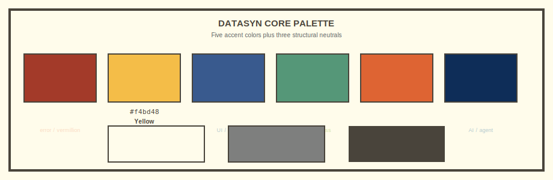
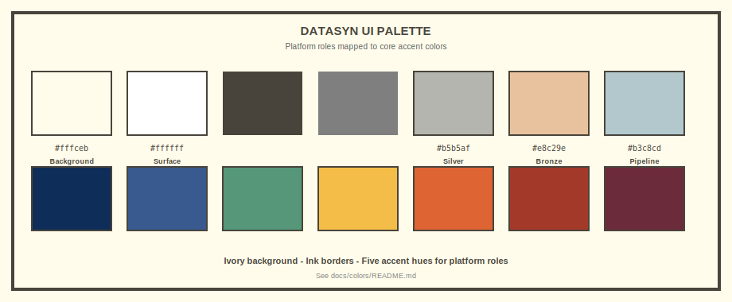

# datasyn colors

Light, architectural palette for diagrams and UI: ivory canvas, ink strokes, and five strong accent hues mapped to platform roles.

## 1. Core palette

Five accents plus three structural neutrals:



| Name | Hex | Typical use |
|------|-----|-------------|
| **Red** | `#a33a29` | Error, stop |
| **Yellow** | `#f4bd48` | Warning, gold layer |
| **Blue** | `#395a8e` | UI, brain |
| **Green** | `#559778` | SQL, success |
| **Orange** | `#de6433` | Storage, MinIO |
| **Navy** | `#0e2d58` | AI, agent (primary) |
| **Ivory** | `#fffceb` | Background |
| **Grey** | `#7e7f7e` | Muted text |
| **Ink** | `#49443b` | Borders, headings |

## 2. datasyn UI palette (role mapping)



| Role | Hex | Name |
|------|-----|------|
| Background | `#fffceb` | Ivory |
| Surface / card | `#ffffff` | White |
| Ink / borders | `#49443b` | Ink |
| Muted text | `#7e7f7e` | Grey |
| Light divider | `#b5b5af` | Light grey |
| **AI / agent** | `#0e2d58` | Navy |
| **UI / brain** | `#395a8e` | Blue |
| **SQL / DuckDB / success** | `#559778` | Green |
| **Warning / Langfuse / gold** | `#f4bd48` | Yellow |
| **Storage / MinIO** | `#de6433` | Orange |
| **Error** | `#a33a29` | Red |
| **Dagster** | `#6c2b3b` | Deep red |
| Pipeline tint | `#b3c8cd` | Powder blue |
| Bronze layer | `#e8c29e` | Warm sand |
| Silver layer | `#b5b5af` | Light grey |
| Gold layer | `#f4bd48` | Yellow |

## 3. Usage rules

- **Background is light (`#fffceb`)** — not dark-themed. Visual contract: ivory + ink + accent blocks.
- **Strokes are thick** (2px+) and **dark** (`#49443b`).
- **Solid accent blocks** — no gloss; gradients only on neutral panels where needed.
- **One accent per role** — pick the role color, do not mix accents on one component.
- **Medallion layers**: warm sand (bronze), light grey (silver), yellow (gold).

## 4. Files in this folder

| File | Purpose |
|------|---------|
| `README.md` | This document |
| `core-palette.svg` | Core 9-color reference |
| `datasyn-palette.svg` | UI role mapping |

## 5. Diagram SVGs

The five README diagrams live in [`../diagrams/`](../diagrams/) — edit the `.svg` files; the README references them with ``.

```bash
xmllint --noout docs/diagrams/*.svg
```
